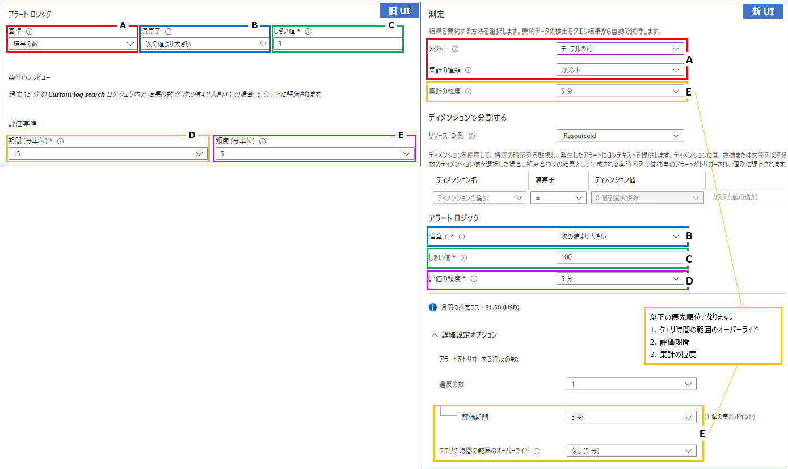
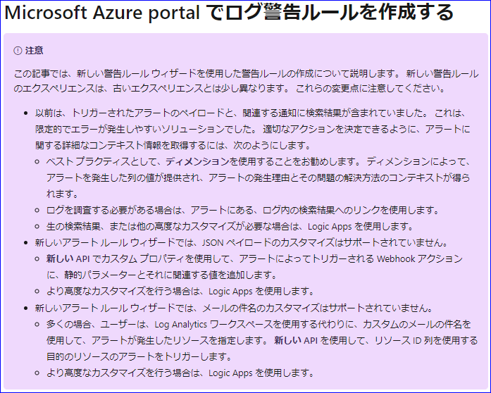

2022/03/25 : 旧 UI と現 UI での対応表/図について、詳細設定オプションを考慮する内容に更新いたしました。  
2022/07/01 : ロジック アプリから Log Analytics API を実行する記事について追記しました。
- - - -
こんにちは！Azure Monitoring & Integration サポート チームの花房です。  
「アラート通知メールを日本語にしたい」、「最近ログ アラート ルール作成画面が変わった？」 というお問い合わせを最近よくいただきます。
今回はアラート通知メールのカスタマイズに関連した以下の点についてご案内いたします。

<!-- more -->

## 目次
- アラート通知メールはカスタマイズできない
- 新しい API バージョン (API バージョン 2021-08-01) のログ アラート ルール作成画面
- まとめ

## アラート通知メールはカスタマイズできない
Azure Monitor のアラート機能では、メトリックやログをトリガーにアラート通知メールを発報することができます。

このアラート通知メールは基本的にカスタマイズすることはできません。
このため、「日本語の通知メールにする」 や 「メールのフォーマットをカスタマイズする」、「メールのタイトルを任意の値にする」 ということはできません。

ただ、どうしてもカスタマイズしたメールを送る必要がある場合には、Logic Apps や Azure Function 等を用いてお客様側でアラート通知を実装するという代替案もございます。
お客様のご利用目的に合わせて実装することで、適切な通知方法や通知内容を構成することが可能です。
一方で、お客様にてスクリプトなどの作り込みが必要となるため、既定で用意されているメール通知と比較して実装に要する工数が増大する点はご留意ください。
今回はこの代替案の詳細は割愛いたしますが、一例として以下の <Logic Apps の参考サイト> をご参照いただき、詳しくお知りになりたい点はお気軽に私たちサポートにお問い合わせください！

<Logic Apps の参考サイト>
-- 概要 - Azure Logic Apps とは
https://docs.microsoft.com/ja-jp/azure/logic-apps/logic-apps-overview
Logic App とは、ロジック アプリ デザイナーでフロー チャートを用いて作成したワークフローを自動実行するソリューションです。
Logic App では、条件分岐などを実装することができ、ワークフローの実行状況に応じて実行する処理を分岐することが可能です。

メールの通知内容をカスタマイズする際の詳細な手順につきましては、下記弊社公開情報をご覧ください。
-- Azure Monitor アラートによって複雑なアクションをトリガーする方法
https://docs.microsoft.com/ja-jp/azure/azure-monitor/platform/action-groups-logic-app
※ アラート ルールの種類により設定手順は異なります。
&nbsp;&nbsp;&nbsp;アクティビティ ログ アラートの手順を進めていただき、手順 4 のペイロードは以下公開情報に記載のあるサンプル ペイロードをご使用ください。
&nbsp;&nbsp;&nbsp;-- ログ アラート ルールの webhook アクション
&nbsp;&nbsp;&nbsp;https://docs.microsoft.com/ja-jp/azure/azure-monitor/alerts/alerts-log-webhook#sample-payloads

※ 上記ドキュメント内の、
&nbsp;&nbsp;&nbsp;Teams へのメッセージ送信である箇所 「7. Microsoft Teams コネクタを検索して選択します。 [Microsoft Teams – メッセージの投稿] アクションを選択します。」 を、以下のアクションに置き換えていただくことで、お客様にて件名等のメールの内容をカスタマイズ可能です。  
&nbsp;&nbsp;&nbsp;-- Microsoft 365 Outlook
&nbsp;&nbsp;&nbsp;https://docs.microsoft.com/en-us/connectors/office365/#send-an-email-[deprecated]
&nbsp;&nbsp;&nbsp;※ 「Send an email [DEPRECATED]」 をご参照ください。

また、弊社 Integration Support Blog にロジック アプリからログ アラート発報時に出力されたデータに含まれている Log Analytics API を実行する方法に関する記事が投稿されております。  
カスタマイズされたメールをロジック アプリから通知する方法をご検討の場合、下記の記事をご参考いただけますと幸いです。  
&nbsp;&nbsp;&nbsp;-- ログ アラート ルールの発報時に出力されたデータからクエリの検索結果を取得する
&nbsp;&nbsp;&nbsp;https://jpazinteg.github.io/blog/LogicApps/Integration-logAlertRule/

## 新しい API バージョン (API バージョン 2021-08-01) のログ アラート ルール作成画面
ここまでお読みいただいて 「ログ アラート ルールであれば、メールのタイトルは任意の値にできるのでは？」 と思われた方もいるかもしれません。
はい、以前の API (バージョン 2018-04-16 以前) であれば、ログ アラート ルールのタイトルのカスタマイズが可能でした。
ただ、2021 年 12 月下旬より新しい API (バージョン 2021-08-01) の UI のリリースが開始され、現在の Azure ポータルはアラート ルール作成における動作の一部に変更がなされています。
このリリースにより、現在はタイトルを含めアラート通知メールのカスタマイズはできなくなりました。
※ 詳細は、後述の <参考サイト> もご参照ください。
なお、以前の UI で作成されたアラート ルールは、今後も以前の UI で表示されます。

#### ■ 相違点 ■
このリリースによる変更でお問い合わせいただくことが多い相違点 2 点について、以下にご案内します。

**相違点 1. [アクションのカスタマイズ] は使用できない**
以前は可能だった [メールの件名] 、および [Webhook 用のカスタム Json ペイロード] の項目は使用できなくなりました。
具体的には以下の項目となります。

**相違点 2. [シグナル ロジックの構成] の項目が変更された**
アラート ルールの条件で指定する、[シグナル ロジックの構成] の項目が変更されました。
ただ、項目は変更されましたが、以前と同じ条件の設定をすることは可能です。
新旧で対応している項目については、以下となります。

<対応表 / 図>

例えば、旧 UI で [基準 : 結果の数] と選択していたら、新 UI では [メジャー : テーブルの行] / [集計の種類 : カウント] と設定すると同じ意味の構成になります。

※ 旧 UI [期間 (分単位)] について ※
-1. [クエリの時間の範囲のオーバーライド] が明示的に指定されている場合、この値が [期間 (分単位)] に相当します。
-2. [クエリの時間の範囲のオーバーライド] が明示的に指定されていない場合、[評価期間] が [期間 (分単位)] に相当します。
-3. [クエリの時間の範囲のオーバーライド] 及び [評価期間] が指定されていない場合、[評価の粒度] が [期間 (分単位)] に相当します。

#### ■ 代替案 ■
前述の通り、新しいアラート ルール作成画面から以前と同様のアラート メールを設定することはできません。
ただ、旧 API バージョンの ARM テンプレートや REST APIを使用してアラートをデプロイすることで、以前と同様のカスタマイズをすることが可能です。

以下の弊社サイトの 「(バージョン 2018-04-16 以前) 」 と記載されたテンプレートは旧 API バージョンの ARM テンプレートになります。
-- Azure Monitor のログ アラート ルール用の Resource Manager テンプレートのサンプル
https://docs.microsoft.com/ja-jp/azure/azure-monitor/alerts/resource-manager-alerts-log

こちらの ARM テンプレートにて以前の API を指定することで通知されるメール タイトルをカスタマイズしてアラート ルールを作成することが可能です。

<参考サイト>
このリリースによる仕様変更は、以下の弊社サイトもご参照ください。
-- Azure Monitor を使用してログ アラートを作成、表示、管理する
https://docs.microsoft.com/ja-jp/azure/azure-monitor/alerts/alerts-log#create-a-log-alert-rule-in-the-azure-portal

【概要】
この記事では、新しいログ アラート ルールの変更についてご案内しており、概要としては以下となります。
・ 検索結果は、トリガーされたアラートとそれに関連する通知には含まれません。アラートには、ログの検索結果へのリンクが含まれています。
・ 新しいアラート ルール ウィザードには、トリガーされたアラートの電子メールをカスタマイズしたり、カスタム JSON ペイロードを含めたりするオプションは含まれていません。
・ 新しいアラート ルール ウィザードは現在 1 分の頻度をサポートしていません。1 分間のアラート頻度はまもなくサポートされます。

## まとめ
本記事では、以下についてご案内いたしましたが、ご理解いただけましたでしょうか。

- アラート通知メールをカスタマイズすることはできない
    -- 代替案は、Logic Apps や Azure Functions 等を用いてアラート通知を実装する
- 2021 年 12 月から新しい API  (バージョン 2021-08-01)  のアラート ルール作成画面のリリースが開始された
    -- 代替案は、旧 API バージョンの ARM テンプレートや REST APIを使用してアラートをデプロイ

以上、アラート通知メールのカスタマイズについてご案内いたしました。

本記事が少しでもお役に立ちましたら幸いです。
最後までお読みいただき、ありがとうございました！
