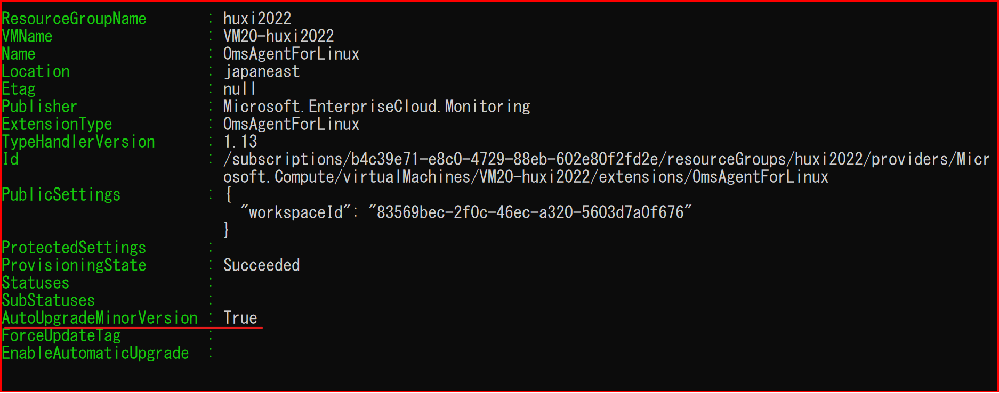
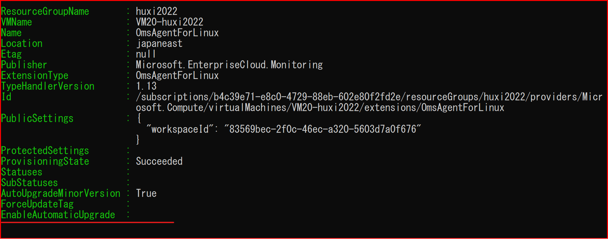
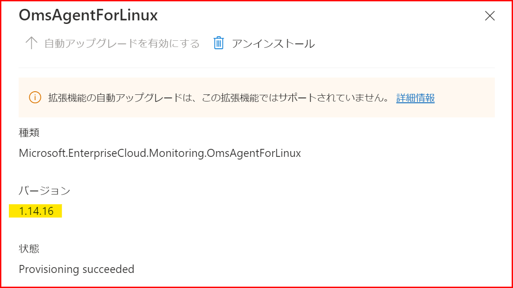
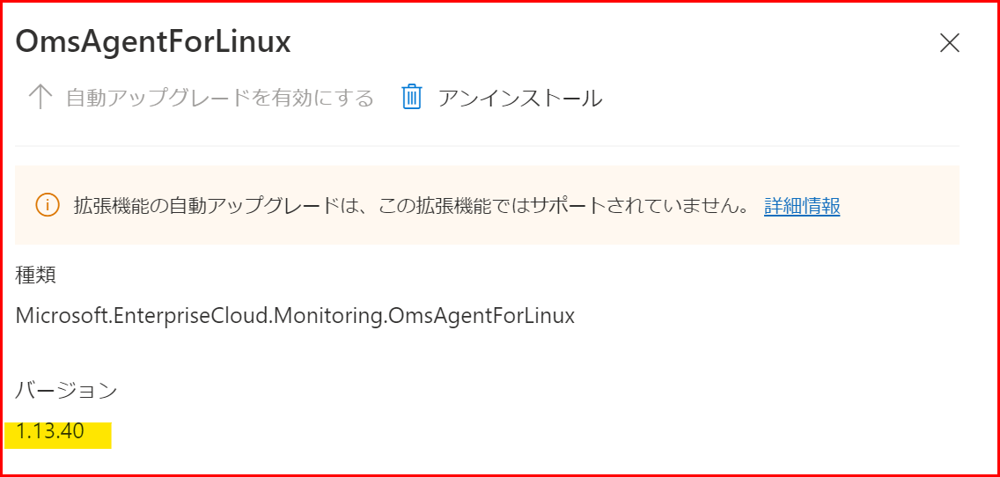

こんにちは、Azure Monitoring チームの 胡 です。

Log Analytics 仮想マシン拡張機能を利用してログの収集を行っている方がたくさんいらっしゃると思います。
より良いログ収集の体験ができるよう、弊社としましては常に最新バージョンの拡張機能を利用するよう、お客様にお願いしております。
この度、 Azure 仮想マシンで対応している拡張機能について、自動アップグレードの仕組みに大きな変更がございましたため、
Log Analytics 仮想マシン拡張機能のバージョン アップ方法について、ご案内させていただきます。

<!-- more -->

## 目次
- 対象製品
- 2021 年まで Log Analytics 仮想マシン拡張機能のバージョン アップについて
- 現在 Log Analytics 仮想マシン拡張機能のバージョン アップについて
- Log Analytics 仮想マシン拡張機能のバージョン アップ手順
- 今後 Log Analytics 仮想マシン拡張機能の自動アップグレード対応について

## 対象製品
Windows 用の Log Analytics 仮想マシン拡張機能

https://docs.microsoft.com/ja-jp/azure/virtual-machines/extensions/oms-windows?toc=%2Fazure%2Fazure-monitor%2Ftoc.json
 
Linux 用の Log Analytics 仮想マシン拡張機能

https://docs.microsoft.com/ja-jp/azure/virtual-machines/extensions/oms-linux?toc=%2Fazure%2Fazure-monitor%2Ftoc.json

## 2021 年まで Log Analytics 仮想マシン拡張機能のバージョン アップについて
2021 年まで新しいマイナー バージョンの Log Analytics 仮想マシン拡張機能がリリースされますと、自動的にインストールされておりました。
それは、 Log Analytics エージェントを含めて、仮想マシンで対応している拡張機能に存在する AutoUpgradeMinorVersion というプロパティで実現しております。

Get-AzVMExtension コマンドを利用して、各プロパティの値をご確認いただけます。
以下のとおり、 Log Analytics 拡張機能の AutoUpgradeMinorVersion のプロパティは true となっております。

`Get-AzVMExtension -ResourceGroupName <リソースグループ名> -VMName <仮想マシン名> -Name <拡張機能名>`

2021 年まで、 AutoUpgradeMinorVersion が true と設定されている拡張機能について、新しいマイナー バージョンがリリースされると、その情報は仮想マシンまで連携されます。
仮想マシンが主体的に最新バージョンのものを取得して、バージョン アップを行っておりました。
ですが、このバージョン アップのタイミングはきちんとコントロールされておらず、任意のタイミングで発生する可能性がございます。
一部のお客様から拡張機能の自動バージョン アップで自分のアプリケーションが影響されましたとの報告を受けました。
また、仮想マシン スケール セットの場合、すべてのインスタンスにおいて同時にバージョン アップが発生することがあるため、その影響範囲がさらに大きくなる可能性がございます。
以上のように、従来より安全な拡張機能のバージョン アップ方式を実現するために、今回自動アップグレードの内部処理で実装を変更いたしました。
Log Analytics 仮想マシン拡張機能はその実装変更の影響で、バージョン アップの方式に変更がございました。

## 現在 Log Analytics 仮想マシン拡張機能のバージョン アップについて
実装変更後に自動アップグレードを利用するには、 EnableAutomaticUpgrade のプロパティを true に設定する必要がございます。
残念ながら、以下のとおり、現時点で Log Analytics 仮想マシン拡張機能は該当プロパティに対応しておらず、値が以下のように null となっております。

Log Analytics 仮想マシン拡張機能のバージョン アップについて、現在の実装をまとめました。

**・Azure ポータルからのデプロイ**

自動的に最新バージョンをインストールするようになっております。

**・PowerShell や Azure CLI でのデプロイ**

明示的に EnableAutomaticUpgrade を無効にしなければ、自動的に最新バージョンをインストールするようになっております。
例えば、以下のコマンドで TypeHandlerVersion を古い 1.13 に指定しておりますが、 EnableAutomaticUpgrade を明示的に無効にしていないため、自動的に最新 1.14.16 がインストールされます。

`Set-AzVMExtension -ExtensionName "OmsAgentForLinux" -ResourceGroupName "huxi2022" -VMName "VM20-huxi2022" -Publisher "Microsoft.EnterpriseCloud.Monitoring" -ExtensionType "OmsAgentForLinux" -TypeHandlerVersion 1.13 -Settings $PublicSettings -ProtectedSettings $ProtectedSettings -Location "japaneast"` 

DisableAutoUpgradeMinorVersion を追加して、明示的に EnableAutomaticUpgrade を無効にすることで、古いバージョンをインストールすることが可能でございます。

`Set-AzVMExtension -ExtensionName "OmsAgentForLinux" -ResourceGroupName "huxi2022" -VMName "VM20-huxi2022" -Publisher "Microsoft.EnterpriseCloud.Monitoring" -ExtensionType "OmsAgentForLinux" -TypeHandlerVersion 1.13 -Settings $PublicSettings -ProtectedSettings $ProtectedSettings -Location "japaneast" -DisableAutoUpgradeMinorVersion`

**デプロイ後**

Log Analytics 仮想マシン拡張機能は EnableAutomaticUpgrade を対応していないため、現在デプロイ後のバージョン アップは、手動で実施する必要がございます。
 

## Log Analytics 仮想マシン拡張機能のバージョン アップ手順
仮想マシン及び仮想マシン スケール セットについて、それぞれ手順をまとめました。

**仮想マシン**

- Azure ポータルを使ったバージョン アップ

1. 拡張機能を削除する
    1. Azure ポータルにログインし、対象の VM の画面に遷移します。
    2. 中央に表示されているブレードから [拡張機能とアプリケーション] を選択し、Windows の場合は、"MicrosoftMonitoringAgent" をクリックします。
    3. Linux の場合は、 "OmsAgentForLinux" をクリックします。
    4. 画面上部の [アンインストール] をクリックします。

2. Log Analytics エージェントを拡張機能としてインストールする
    1. Azure ポータルにログインします。
    2. VM が接続中のワークスペースを選択します。
    3. [ワークスペースのデータ ソース] – [仮想マシン] をクリックします。
    4. 当該の VM を選択します。
    5. [接続] をクリックします。

- PowerShell/Azure CLI を使ったバージョン アップ

以下のコマンドを実行することで最新バージョンにアップデートすることが可能です (バージョンの指定は必要ございません)。

1. PowerShell

`Set-AzVMExtension -location $Location -ResourceGroupName $ResourceGroupName -VMName $MyVm -Name $Extname -Publisher $Extpublisher -ExtensionType $ExtType`

2. Azure CLI

`az vm extension set -n $Extname --publisher $Publisher --vm-name $MyVm --resource-group $ResourceGroupName`

**仮想マシン スケール セット**

1. Log Analytics エージェントの拡張機能をアンインストールする
    1. Azure ポータルにログインし、当該の VMSS を選択します。
    2. [設定] – [拡張機能] を選択します。
    3. OmsAgentForLinux を選択し、アンインストールします。
2. VMSS インスタンスのアップグレードを実施する ※ VMSS のアップグレード ポリシーが手動と設定されている場合のみに実施します。
    1. Azure ポータルにアクセスし、対象の VMSS リソースを表示します。
    2. [設定] – [インスタンス] をクリックし、各インスタンスにチェックし、[アップグレード] をクリックします。[はい] をクリックします。完了するまで待機します。
3. VMSS の拡張機能をインストールする (Log Analytics エージェント)
    1. 以下の Azure CLI コマンドを実行してインストールします。
`az vmss extension set --name OmsAgentForLinux --publisher Microsoft.EnterpriseCloud.Monitoring --resource-group <VMSS のリソース グループ名> --vmss-name <VMSS 名> --settings "{'workspaceId':'<Log AnalyticsworkspaceId>'}" --protected-settings "{'workspaceKey':'<Log AnalyticsworkspaceKey>'}"`
4. VMSS インスタンスのアップグレードを実施する ※ VMSS のアップグレード ポリシーが手動と設定されている場合のみに実施します。
    1. Azure ポータルにアクセスし、対象の VMSS リソースを表示します。
    2. [設定] – [インスタンス] をクリックし、各インスタンスにチェックし、[アップグレード] をクリックします。[はい] をクリックします。完了するまで待機します。

## 今後 Log Analytics 仮想マシン拡張機能の自動アップグレード対応について
自動アップグレードに対応してほしいとのご要望をいただき、開発側にフィードバックさせていただきました。
現時点で今後の開発予定がまだ決まっておりませんので、決まり次第改めて本ブログにでお知らせいたします。

以上、Log Analytics 仮想マシン拡張機能のバージョン アップの仕様についてご案内いたしました。
この度の仕様変更でお客様にご不便とご迷惑おかけしまして、申し訳ございません。
お客様によりよい製品、サービスの提供にこれまで以上に努めて参ります。

※本情報の内容（添付文書、リンク先などを含む）は、作成日時点でのものであり、予告なく変更される場合があります。 