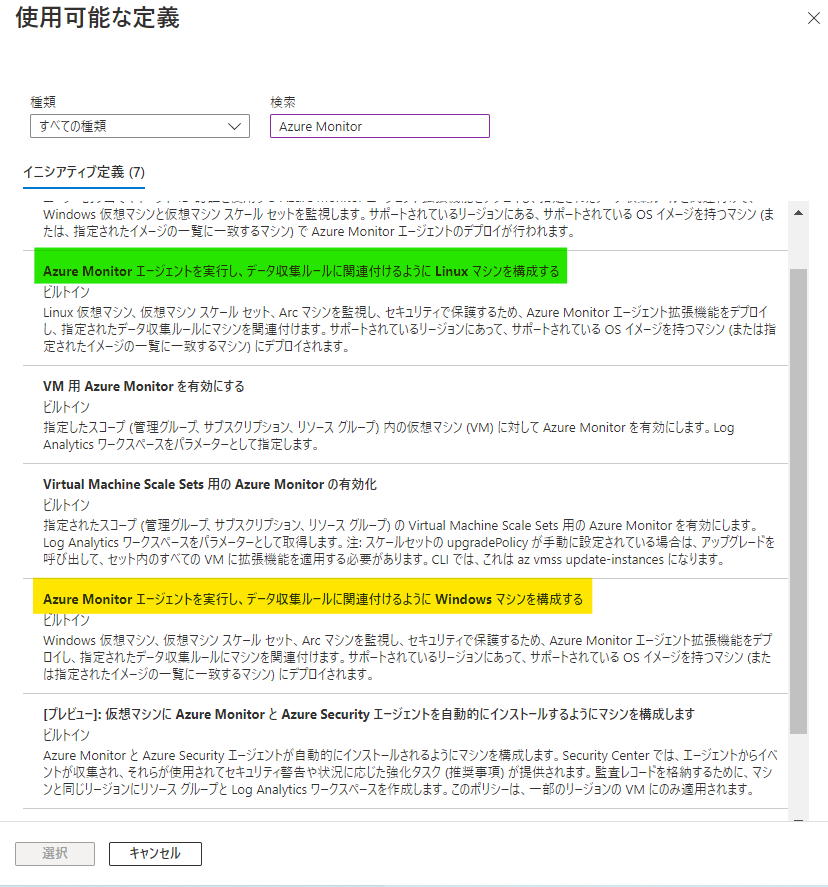
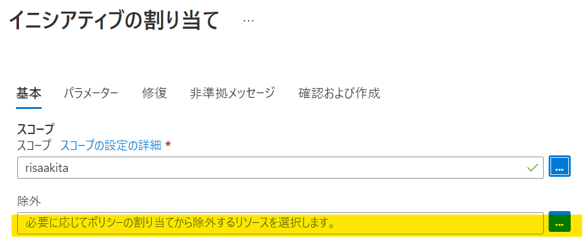

こんにちは！ Azure Monitoring チームの秋田です！
今回は、仮想マシン (以下、VM) を作成したときに自動的に Azure Monitor エージェントのインストールとデータ収集ルールへの関連付けがされるよう設定する方法をご紹介します！

<!-- more -->

## 目次
- どうやって VM 作成時に Azure Monitor エージェントをインストールし、データ収集ルールへの関連付けを行うのか
- 詳細な手順
- 作成時の注意点
- まとめ

## どうやって VM 作成時に Azure Monitor エージェントをインストールし、データ収集ルールへの関連付けを行うのか
Azure Policy の機能のひとつであるポリシー イニシアチブを作成することで、VM 作成時に Azure Monitor エージェントのインストールとデータ収集ルールへの関連付けが自動で行われるよう設定できます。  
そもそも、ポリシー定義とは、JSON 形式で記述されたビジネス ルールのことで、 Azure Policy では、Azure 内のリソースのプロパティとポリシー定義を比較し、リソースの評価を行います。  
そして今回用いるポリシー イニシアチブとは、複数の関連するポリシー定義をグループ化したものを指します。  
  
今回は、このポリシー イニシアチブにより設定する方法をご紹介します。  

## 詳細な手順
### 事前準備
ポリシー イニシアチブを作成する際に、関連付けを行いたいデータ収集ルールのリソース ID が必要となります。  
事前準備としてリソース ID を取得しておく必要があります。  
以下、手順です。  
**事前準備 1**  
Azure ポータルで "モニター" と検索し、サービス一覧の中から [モニター] を開いてください。  

**事前準備 2**  
[設定] メニューにあります [データ収集ルール] をクリックしてください。  
  
**事前準備 3**  
一覧から自動関連付けを行いたいデータ収集ルールをクリックしてください。  

**事前準備 4**  
[概要] ページ右上にあります [JSON ビュー] をクリックしてください。  
  
**事前準備 5**  
一番上に表示されます [リソース ID] をコピーしてください。  
  
以上の手順で、リソース ID の取得が完了し、事前準備は終了となります。  
  
### ポリシー イニシアチブの作成
**手順 1**  
Azure ポータルで "ポリシー" と検索し、サービス一覧の中から [ポリシー] を開いてください。  
  
**手順 2**  
[作成] メニューにあります [割り当て] をクリックしてください。  
  
**手順 3**  
遷移後の画面上部にあります [イニシアティブの割り当て] をクリックしてください。  
  
**手順 4 ([基本] タブ内で行う設定)**  
手順 4-1  
まずは、[スコープ] 欄右端にある [...] をクリックし、ポリシーを適用する対象の範囲 (スコープ) を設定します。  
スコープは、サブスクリプション単位またはリソース グループ単位で設定いただけます。  
  
  
手順 4-2  
使用するイニシアチブ定義を設定します。  
[イニシアティブ定義] 欄の右端にある [...] をクリックしてください。  
検索欄で、"Azure Monitor" と検索ください。  
使用中の VM の OS に応じて下記の通りイニシアチブをご選択いただいたのち、画面下部にあります [選択] をクリックしてください。  
  
Windows OS の場合 -> Azure Monitor エージェントを実行し、データ収集ルールに関連付けるように Windows マシンを構成する  
Linux OS の場合 -> Azure Monitor エージェントを実行し、データ収集ルールに関連付けるように Linux マシンを構成する
  
  

上記の手順 4-1 および手順 4-2 が完了したら、画面下部にあります [次へ] をクリックしてください。  
  
**手順 5 ([パラメーター] タブ内で行う設定)**  
[データ収集ルールのリソース ID] 欄に先ほど事前準備で取得しておいた、関連付けを行いたいデータ収集ルールのリソース ID をペーストしてください。  
完了しましたら画面下部の [確認および作成] をクリックしてください。  
  
以上でポリシー イニシアチブの作成が完了となります。  
  
  
## 作成時の注意点
Azure Monitor エージェントの追加を希望されない VM が存在する場合には、以下の点に注意が必要です。  
既存の VM に対してポリシーが適用され得るタイミングとしては、以下の 2 つのいずれかが該当します。  
- ポリシー作成時
- VM に対して更新操作があった場合 (設定値やプロパティ値などを変更する要求など)
  
### ポリシー作成時
まず、ポリシー作成時に既存の VM にポリシーが適用されないようにするためには、作成画面にて [修復タスクを作成する] のチェックを外してください。  
(デフォルトでは、こちらのチェックは外れております。)  
  

これにより、既存の VM に対してポリシー作成時にポリシーが適用されることを防ぐことができます。  

### 更新適用時
ただ、ポリシー作成時にはポリシー適用対象外となっていても、VM に対して何らかの更新操作があった場合には、一定期間後にポリシーに準拠していないリソースと評価され、ポリシーが適用される可能性があります。  
この場合は、あらかじめポリシーを作成する際に、適用対象外としたい VM を [除外] 項目に入れておく必要があります。  
[除外] については、 [基本] タブ内でご設定いただけます。  
  
ポリシー適用対象外として [除外] に含められるのは、スコープのレベルよりも 1 つ下のレベルとなります。  
例えば、リソース グループをスコープとして設定している場合除外できるのはリソース単位となります。  

## まとめ
今回は、Azure Policy の一機能であるポリシー イニシアチブにより、VM が作成されると自動的に Azure Monitor エージェントのインストールとデータ収集ルールへの関連付けが行われるよう設定する方法をご紹介しました。  
VM 作成時に毎回手動で Azure Monitor エージェントをインストールされていた方など、ぜひこちらの方法もご検討ください。  
