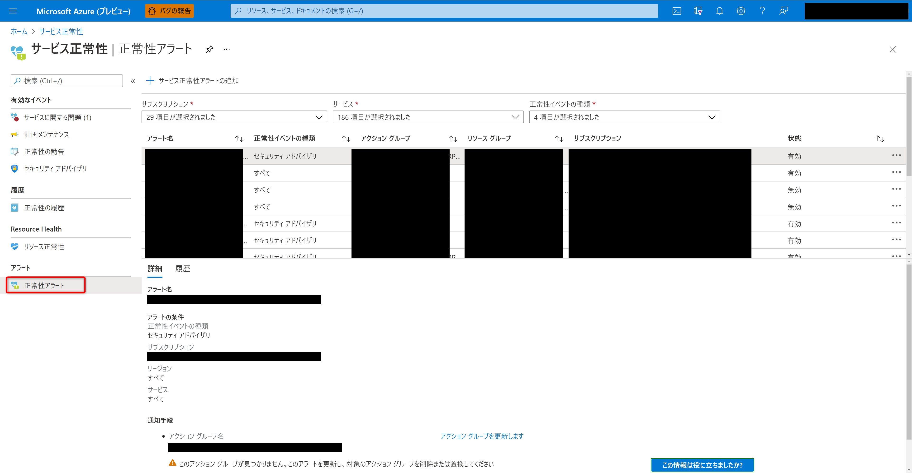

こんにちは、Azure Monitoring & Integration サポート チームの堀です。
今回はサービス正常性アラートの設定手順と推奨設定についてご案内いたします。

<!-- more -->

## 目次
[目次] (#目次)
[サービスの正常性アラートの概要] (#サービスの正常性アラートの概要)
[サービス正常性アラートの設定手順] (#サービス正常性アラートの設定手順)
[サービス正常性アラートの推奨設定] (#サービス正常性アラートの推奨設定)

## サービスの正常性アラートの概要
サービス正常性アラートでは、お客様環境にてご利用いただいている Azure サービスおよびリージョンを監視対象とし、Azure サービス自体の正常性を監視することが可能です。Azure サービスの障害や、計画メンテナンスの情報を監視でき、イベントが発生した際に、メールや SMS 等の方法で管理者にアラート通知できます。

サービス正常性アラートにて検知できるイベントの詳細は、下記弊社公開情報をご覧ください。
-- Service Health の概要
https://docs.microsoft.com/ja-jp/azure/service-health/service-health-overview#service-health-events 
※ [Service Health のイベント] をご覧ください。

## サービス正常性アラートの設定手順
以下に、Azure ポータルよりサービス正常性アラートを設定する方法をご案内いたします。

1. Azureポータルにログインします。 
2. すべてのサービスから [サービス正常性] を開きます。
3. 左ウィンドウの [アラート] - [正常性アラート] のブレードを開きます。

4. 画面上部の [サービス正常性アラートの追加] をクリックします。

5. [アラート ルールの作成] より、アラートの対象となる [サブスクリプション] 、 [サービス] 、 [リージョン] を選択します。
6. 監視対象の [イベントの種類] を選択します。
7. [アクション グループ] の [アクション グループの選択] をクリックします。任意のアクション グループを指定します。
8. [アラートの詳細] より [アラート ルール名] と [説明] を入力します。
9. [リソース グループにアラートを保存します] よりアラート ルールを作成する [リソース グループ] を選択します。
10. [アラート ルールの作成] をクリックします。 
	
手順は以上です。

手順の詳細は、下記弊社公開情報をご覧ください。
-- Azure portal を使用してサービスの通知でアクティビティ ログ アラートを作成する
https://docs.microsoft.com/ja-jp/azure/service-health/alerts-activity-log-service-notifications#alert-and-new-action-group-using-azure-portal

## サービス正常性アラートの推奨設定
サービス正常性アラート設定時の "サービス" や "リージョン" はすべて選択いただくことを推奨しております。
サービス正常性アラートは、ご利用いただいているサービスのご利用いただいているリージョンを対象としたイベントが発生した場合にのみ通知が行われる仕組みです。
このため、サブスクリプション上のすべてのサービス、リージョンおよびイベントの種類を選択した場合にも、利用していないリソースに対してアラートは発生いたしません。