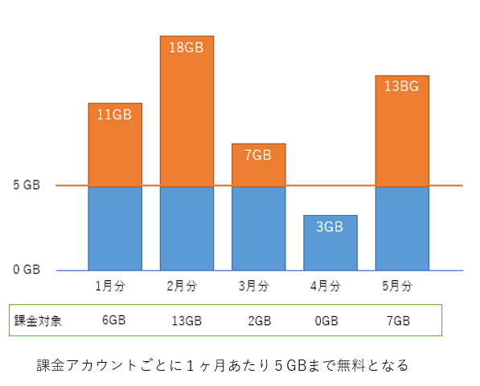
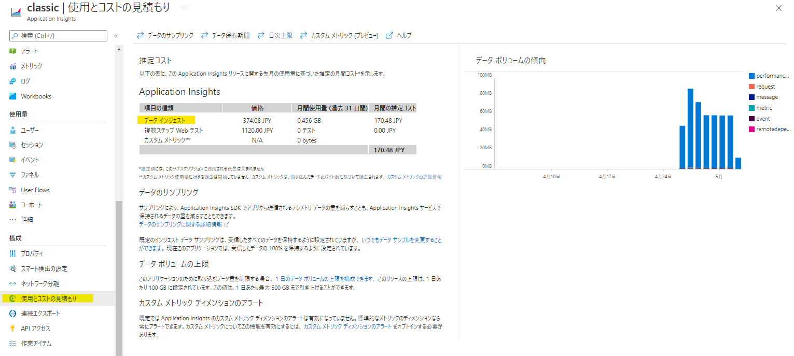
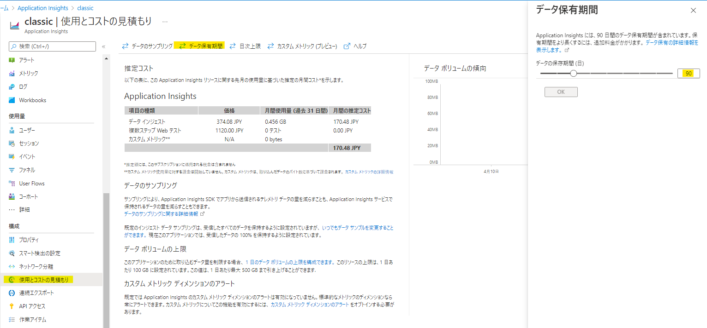
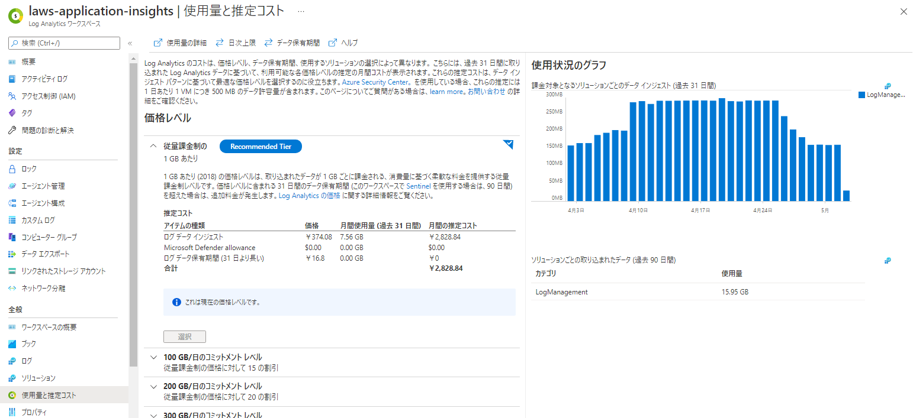

こんにちは、Azure Monitoring サポート チームの六浦です。

今回は Application Insights のログに関する料金についてご案内いたします。

<!-- more -->

## 目次
- [目次](#目次)
- [Application Insights のログの料金](#application-insights-のログの料金)
  - [ログ データの保持に対するコスト](#ログ-データの保持に対するコスト)
  - [ログ データのインジェストに対するコスト](#ログ-データのインジェストに対するコスト)
- [現在の料金を見積もる方法](#現在の料金を見積もる方法)
  - [クラシック版](#クラシック版)
    - [ログ データのインジェストに対するコスト](#ログ-データのインジェストに対するコスト-1)
    - [ログ データの保持に対するコスト](#ログ-データの保持に対するコスト-1)
  - [ワークスペース版](#ワークスペース版)
    - [ログ データのインジェストに対するコスト](#ログ-データのインジェストに対するコスト-2)
    - [ログ データの保持に対するコスト](#ログ-データの保持に対するコスト-2)
- [クエリを用いてコストを確認](#クエリを用いてコストを確認)
- [まとめ](#まとめ)


## Application Insights のログの料金
Application Insights のログに対して発生する料金は下記の 2 つがございます。
1. ログ データの保持に対するコスト
2. ログ データのインジェストに対するコスト


2 つの料金の課金方法の仕組みついてご案内いたします。

### ログ データの保持に対するコスト
Application Insights に取り込まれたデータは 90 日間無料で保持されます。
Application Insights のデータ保持期間を 90 日にご設定いただければ費用は発生いたしません。
つまり、保持期間が 90 日を超えなければ、ログ データの保持に対するコストは 0 円です。
※ Application Insights のデフォルト保持期間は 90 日間でございます。

たとえば、データを 365 日間保持する設定で、毎月 11 GB ずつデータを取り込んだ場合、
1 年分のデータがたまった状態になると、以下の図のようにおよそ 9 ヶ月分のデータに対して課金が発生いたします。


### ログ データのインジェストに対するコスト
従量課金制の価格レベルをご使用の場合は、1 か月あたり課金アカウントごとに 5 GB まで無料でございます。
以下のように毎月 5 GB を超えたデータに、料金が発生いたします。



Application Insights の課金について詳しくは、以下の弊社公開情報からご確認いただけます。
[価格 - Azure Monitor | Microsoft Azure](https://azure.microsoft.com/ja-jp/pricing/details/monitor/)


## 現在の料金を見積もる方法
### クラシック版
Application Insights の [構成] > [使用とコストの見積もり] から現在の料金の見積もりをご確認いただけます。

#### ログ データのインジェストに対するコスト
データのインジェストは以下の表から確認できます。
ここで表示されるデータ インジェスト量は 5 GB の無料枠は考慮されておりませんので、ご注意くださいませ。



#### ログ データの保持に対するコスト
保有期間を確認して、Application Insights のログ データにコストが発生しているか確認できます。
データ保有期間は、[データ保有期間] を選択して、画面右側に表示されるメニューから確認いただけます。
保有期間が 90 日以内に設定されていれば、データの保持の料金は発生しません。



### ワークスペース版
ワークスペース版の Application Insights は Log Analytics ワークスペースにログ データを保持しているため、Log Analytics ワークスペースにてデータ保有期間とデータのインジェストの料金を確認します。

#### ログ データのインジェストに対するコスト
Application Insights が接続している Log Analytics ワークスペースから確認する必要がございます。
Application Insights が接続している Log Analytics ワークスペースは [概要] のワークスペースからご確認いただけます。


Application Insights が接続している Log Analytics ワークスペースの [全般] > [使用量と推定コスト] からログ データ インジェスト量を確認いただけます。
ここで表示されるデータ インジェスト量も 5 GB の無料枠は考慮されておりませんので、ご注意くださいませ。


上記の画面で表示されているログ データ インジェスト量は、Log Analytics ワークスペース全体のインジェスト量でございます。
複数の Application Insights が 1 つの Log Analytics ワークスペースに接続している場合や、他のリソースのログを Log Analytics ワークスペースに収集している場合は、それらのログの合計のインジェスト量が表示されます。
リソースごとのインジェスト量を調べるには、Log Analytics ワークスペースで以下のクエリを実行してご確認いただけます。
```
union AppAvailabilityResults, AppBrowserTimings, AppDependencies, AppExceptions, AppEvents, AppMetrics, AppPageViews, AppPerformanceCounters, AppRequests, AppSystemEvents, AppTraces
| where TimeGenerated >= startofday(ago(30d)) and TimeGenerated < startofday(now())
| summarize sum(_BilledSize) by _ResourceId
```

#### ログ データの保持に対するコスト
データの保持期間は REST API を使用して確認する必要がございます。
以下の PowerShell スクリプトを実行すると、Log Analytics ワークスペースの Application Insights で使用されるテーブルのデータの保持期間を確認できます。
```
$azContext = Get-AzContext
$azProfile = [Microsoft.Azure.Commands.Common.Authentication.Abstractions.AzureRmProfileProvider]::Instance.Profile
$profileClient = New-Object -TypeName Microsoft.Azure.Commands.ResourceManager.Common.RMProfileClient -ArgumentList ($azProfile)
$token = $profileClient.AcquireAccessToken($azContext.Subscription.TenantId)
$authHeader = @{
    'Content-Type'='application/json'
    'Authorization'='Bearer ' + $token.AccessToken
}
 
$subscriptionId = "<サブスクリプション ID>"
$workspaceRgName = "<リソース グループ名>"
$workspaceName = "<Log Analytics ワークスペース名>"
 
$url = "https://management.azure.com/subscriptions/$subscriptionId/resourceGroups/$workspaceRgName/providers/Microsoft.OperationalInsights/workspaces/$workspaceName/Tables?api-version=2021-12-01-preview"

$response = Invoke-RestMethod $url -Method GET -Headers $authHeader
$response.value `
| Where-Object {$_.name -match "AppAvailabilityResults|AppBrowserTimings|AppDependencies|AppExceptions|AppEvents|AppMetrics|AppPageViews|AppPerformanceCounters|AppRequests|AppSystemEvents|AppTraces"} `
| Select-Object -Property name -ExpandProperty properties `
| Select-Object -Property name, retentionInDays
```


## クエリを用いてコストを確認
課金の対象となるログ データのサイズは _BilledSize 列で定義されます。
そのため、_BilledSize 列を使用することで、現在取り込まれている課金の対象のログのサイズを確認することができます。

弊社公開情報にて、コストの確認に使用するクエリの例を紹介しております。
クラシック版の Application Insights の場合は、こちらの弊社公開情報をご参照ください。
クエリは Application Insights で実行します。
[Applicationインサイトデータ](https://docs.microsoft.com/ja-jp/azure/azure-monitor/logs/analyze-usage#application-insights-data)

ワークスペース版の Application Insights の場合は、こちらの弊社公開情報をご参照ください。
以下の弊社公開情報のクエリは Application Insights が接続している Log Analytics ワークスペースで実行します。
[ワークスペースベースのリソースのデータボリュームの傾向](https://docs.microsoft.com/ja-jp/azure/azure-monitor/logs/analyze-usage#data-volume-trends-for-workspace-based-resources)


## まとめ
本記事では、以下についてご案内いたしましたが、ご理解いただけましたでしょうか。
- Application Insights のログの料金
- 現在の料金を見積もる方法
- クエリを用いてコストを確認

本記事が少しでもお役に立ちましたら幸いです。
最後までお読みいただきありがとうございました！

